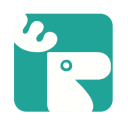
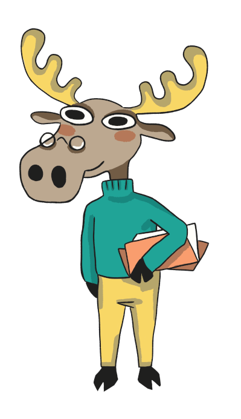

#<h1 align="center">Svět yâd</h1> 

<b>An extensible language learning echo-system</b>
Ofcourse you can search for the meaning, and save the word into your short term memory (keep it for 6 sec), but we all know process of transfering a word from your mind-language to daily speek is not this easy.

## Why another language learning?

1) We want to focus on user provided data rather that our data. 
What does "user provided data" it mean? Simply user provide their own words and we provide tools to help him succesfuly learn it. Most language learning platform feed user by thier own data, that may cover lots of unknown but it definetly is not working in user context.
> How many times did you face a new word while you are reading?

2) We want to make learning new words fun!
Our goal is to provide tools to make learning new vocabulary easier and entertaining at the same time. Our app is not for everyone but we want to make it enjoyable for everyone!
> We recreate some old minigames and even create new minigames.

3)Here is were we think we have a new idea 👍🏻
Nowadyas every one knows that a words must be memorized in a context. Our Jobs is to bind and connect context for you. Wait a second 🤠, this is what all other apps do too, so what's the point?
> This is our secret sauce.

## About project and the team 😄 

"Svět" means (world) in Czech language yâd means (thought, idea) in Persian.

Our team is made of 3 friends. We are just a geeks who want to have fun and make learning new vocabulary more enjoyable. One of us is from Iran and the other two is from Czech Republic.

## We have our own mascot and he have lots of buddies! 

> His is Moose and this animal represent headstrong, unstoppable, longevity! 

<small>Do **Open-source** do **Big**!<small>
